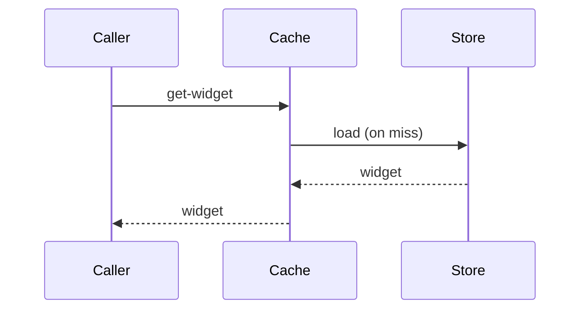

# Widget caching

## Problem

You want to read a widget without hitting the record store every
time.

## Solution

We keep a per-widget in-memory cache in front of the record store.

## References

- [system-components.md](system-components.md) — component
  registration pattern the cache uses
